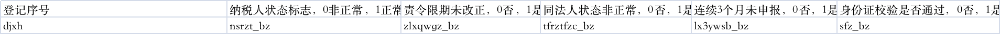

# svm训练
#### 1、数据准备。
##### 输入数据formatDate.txt
##### 表头解释
### 2、执行函数 svm.py
##### 模型参数在svm_fit函数中修改 : 这里模型选用的参数 C=2，kernel（核函数）='rbf'（高斯核函数）
#,gamma=8（核函数系数）, decision_function_shape='ovo'（ovo为one v one，类别两两之间划分
#，用二分类的方法模拟多分类的结果）)
##### 模型训练结果保存train_model.m and result.xlsx中
